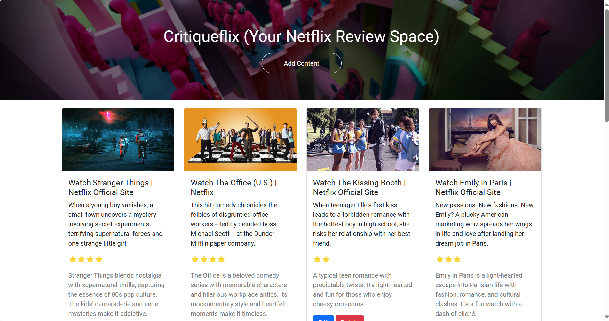

# Critiqueflix
Share your thoughts on Netflix content with Critiqueflix! Add reviews, rate your favorite shows and movies, and manage your Netflix watchlist all in one place.

## Overview
Critiqueflix is a web application that allows users to add, review, and rate Netflix content. Users can view detailed information about each piece of content, edit or delete their reviews, and see all their reviewed content in a visually appealing, easy-to-navigate interface. Built with Flask, MongoDB, and Bootstrap, Critiqueflix ensures a seamless user experience.

## Key Features
### 1. Home Page

- Display a list of all reviewed Netflix content.
- Fetch content metadata, including title, description, and image, directly from the Netflix URL.
- Dynamic display of content with ratings and user comments.
- Navigate to add content using the "Add Content" button.

### 2. Add Content

- Add new Netflix content by entering the Netflix URL.
- Automatically fetch and display the title, description, and image of the content.
- Leave a personalized review and rate the content from 1 to 5 stars.
- Submit the review to save it to the database.

### 3. Edit Content

- Edit existing reviews and ratings.
- Update the review content directly from the home page.
- Prompt the user for a new rating and comment.

### 4. Delete Content

- Remove any reviewed content from the list.
- Prompt the user to confirm deletion.
- Immediately update the display upon deletion.

## Tech Stack
- **Flask**: Backend framework for handling routes and API requests.
- **MongoDB**: Database for storing content details, reviews, and ratings.
- **Bootstrap**: Frontend framework for a responsive and modern design.
- **BeautifulSoup**: For web scraping content metadata from Netflix URLs.
- **HTML/CSS**: For structuring and styling the application.
